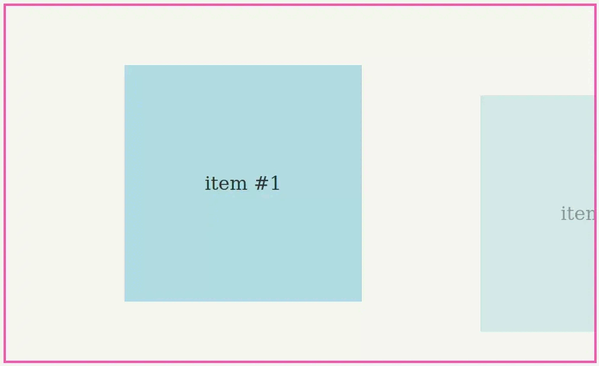
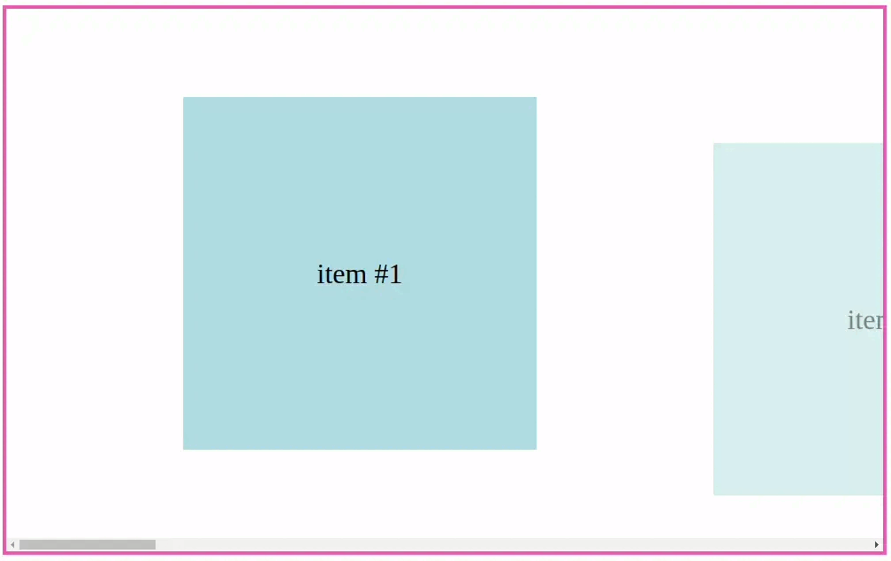

# blink-scroll-snap-bug-poc

Live Codesandbox: https://codesandbox.io/s/github/alexghr/blink-scroll-snap-bug-poc

This is a reproduction of a bug I encountered in Blink: scrolling is broken when scroll-snap is enabled while using an IntersectionObserver to apply CSS transforms. You can see a recording below of how it looks in various browsers, notice Firefox renders it correctly.

Link to bug: https://bugs.chromium.org/p/chromium/issues/detail?id=1330393

## Results

### Firefox (100.0.2)

### Chrome (102.0.5005.61)

